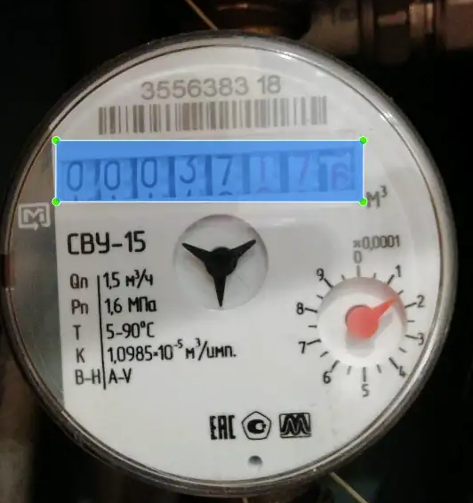

# Applied computer vision: reading water consumption meters
* This small project analyzes the application of computer vision techniques to the reading of water consumption meters.
* Nowadays many companies accept that electricity and water consumption readings be sent through a photo of the meters. That way the company is easily faced with thousands of images that need to be processed.
* This small project aims to analyze techniques that would make it possible to automate this process.
* Note: this study was done a while ago. Some things could be done differently. We are always learning and improving. It remains as a record of my evolution process.. :-)

## Table of Contents
* [General Info](#general-information)
* [Technologies Used](#technologies-used)
* [Objectives and results](#Objectives-and-results)
* [Setup](#setup)
* [Project Status](#project-status)
* [Room for Improvement](#room-for-improvement)
* [Acknowledgements](#acknowledgements)
* [Contact](#contact)
<!-- * [License](#license) -->

## General Information
- This small study is associated with an article published on the blog [brdata](https://medium.com/brdata). The article can be found [here](https://medium.com/brdata/applied-computer-vision-reading-water-consumption-meters-3e4064e961a4).
- The objective of this work is to use Machine Learning techniques to read water consumption meters

## Technologies Used
- Python - version 3.8.8
- Keras - version 2.6.0
- TensorFlow - version 2.6.0
- YOLOv5
- Google Colaboratory

## Objectives and results
* Objetives

* Results

## Setup
* To run the notebook just have Python and Jupyter Notebook installed.
* To facilitate the understanding of the program, it is advisable to read the article that was developed from this work.

## Project Status
* The project was developed as a final project for the Computational Vision discipline of the Master's Degree in Data Science at the Faculty of Sciences of the University of Porto. Despite presenting numerous possibilities for improvement, the project is closed.

## Room for Improvement
* Phases two and three could be implemented with other YOLO networks.
* More images could be used for training and testing, with different inclinations and lighting.

## Acknowledgements
* [FCUP](https://sigarra.up.pt/fcup/pt/web_page.inicial)

## Contact
Rodrigo Salles. Email: engenharia.salles@gmail.com 

...feel free to contact me!

<!-- Optional -->
<!-- ## License -->
<!-- This project is open source and available under the [... License](). -->

<!-- You don't have to include all sections - just the one's relevant to your project -->
